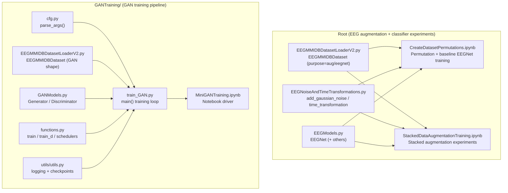

# StackedDataAugEEG

## Executive summary

This repository supports experiments in **stacked data augmentation for EEG classification**, centered on combining (and permuting) multiple augmentation strategies—Gaussian noise, time-domain transformations, and GAN-generated synthetic samples—then evaluating downstream classifier performance. It contains (1) dataset loaders for EEG Motor Movement/Imagery data serialized as Pandas pickles, (2) augmentation utilities, (3) an EEGNet-style classifier implementation (TensorFlow/Keras), and (4) a Transformer-based GAN training pipeline (PyTorch) designed to train **one GAN per class**. fileciteturn26file0L1-L1 fileciteturn27file0L1-L1 fileciteturn25file0L1-L1 fileciteturn38file0L1-L1 fileciteturn33file0L1-L1

Enabled connector used for repository inspection: **GitHub**.

## Repository structure

At a high level there are two “tracks” in this repo:

- **EEG classification / augmentation track (root)**: dataset loader(s), augmentation utilities, EEGNet models, and experiment notebooks that create augmentation permutations and train/evaluate classifiers.
- **GAN training track (`GANTraining/`)**: a Transformer GAN generator/discriminator, training loop, CLI arg parsing, logging/checkpoint utilities, and GAN-focused notebooks.

A practical approximate tree of tracked content:

```text
.
├── .gitattributes
├── EEGModels.py
├── EEGMMIDBDatasetLoaderV2.py
├── EEGNoiseAndTimeTransformations.py
├── CreateDatasetPermutations.ipynb
├── EEGMMIDBDatasetLoaderV2.ipynb
├── PrelimanaryEEGNetTraining.ipynb
├── StackedDataAugmentationTraining.ipynb
└── GANTraining/
    ├── adamw.py
    ├── cfg.py
    ├── EEGMMIDBDatasetLoaderV2.py
    ├── EEGMMIDBDatasetLoaderV2.ipynb
    ├── functions.py
    ├── GANModels.py
    ├── GANAugmentationTrainingV2.ipynb
    ├── MiniGANTraining.ipynb
    ├── train_GAN.py
    └── utils/
        ├── __init__.py
        ├── utils.py
        ├── cal_fid_stat.py
        ├── fid_score.py
        ├── inception.py
        ├── inception_model.py
        ├── inception_score.py
        └── torch_fid_score.py
```

Note: `*.pkl` files are configured for Git LFS via `.gitattributes`, but no `.pkl` files are present in tracked code search results; the notebooks/scripts expect you to provide these dataset pickles separately.

## Minimal setup

### Python version

No explicit version pinning exists in the repository; based on notebook metadata and typical dependencies, **Python 3.8+** is a reasonable baseline assumption (the notebooks show Python 3.9.6 in metadata).

### Data prerequisites

Most workflows assume you have **Pandas pickle files (`.pkl`)** containing a DataFrame with at least:

- `X`: EEG trial array, expected shape `(channels, timepoints)` (commonly `(64, T)`).
- `label`: string labels, default mapping includes: `left_hand`, `right_hand`, `both_hands`, `both_feet`, `rest`.

The label set aligns with the PhysioNet EEG Motor Movement/Imagery dataset task labels (commonly referenced as EEGMMIDB).

### Suggested dependencies

Because the repo mixes **TensorFlow/Keras** (EEGNet models) and **PyTorch** (GAN training), the lightest approach is to install only what you need for your workflow.

Core “loader + augmentation” stack (common to most work):

- `numpy`, `pandas`, `scipy`, `matplotlib`, `tqdm`
- `torch` (dataset classes return `torch.Tensor`)

For EEGNet (TensorFlow/Keras) classifier training:

- `tensorflow>=2` (the included EEG models import `tensorflow.keras`; notes mention TF 2.x verified historically)
- Optional per EEGModels docstring examples: `mne`, `pyriemann`, `scikit-learn`, `matplotlib` 

For GAN training (PyTorch):

- `torch`, `torchvision`
- `einops`, `torchsummary`
- `pillow`, `imageio`, `opencv-python`, `python-dateutil`
- `tensorboard` (PyTorch `SummaryWriter`)

### Example `requirements.txt`

This is intentionally minimal and may need adjustment for your CUDA/PyTorch build and OS:

```text
# Core
numpy
pandas
scipy
matplotlib
tqdm

# Data loading (Dataset classes return torch tensors)
torch

# Augmentation utilities
scipy

# EEGNet (TensorFlow/Keras)
tensorflow>=2.0

# GAN training dependencies
torchvision
einops
torchsummary
pillow
imageio
opencv-python
python-dateutil
tensorboard
```

### Example `environment.yml`

```yaml
name: stacked-data-aug-eeg
channels:
  - conda-forge
  - pytorch
dependencies:
  - python>=3.8
  - pip
  - numpy
  - pandas
  - scipy
  - matplotlib
  - tqdm
  - pip:
      - tensorflow>=2.0
      - torch
      - torchvision
      - einops
      - torchsummary
      - pillow
      - imageio
      - opencv-python
      - python-dateutil
      - tensorboard
```

## Usage examples

### Example workflow: load EEGMMIDB pickle into a PyTorch `Dataset`

Use the root loader if you want flexible output shapes for augmentation (`purpose='aug'`) vs EEGNet training (`purpose='eegnet'`), and optional one-hot labels:

```python
from EEGMMIDBDatasetLoaderV2 import EEGMMIDBDataset

ds = EEGMMIDBDataset(
    pickle_path="/path/to/eegmmidb_train_df.pkl",
    normalize=True,
    purpose="eegnet",     # "aug" or "eegnet"
    onehot=True           # if you need one-hot labels (e.g., Keras)
)

x, y = ds[0]
print(x.shape, y.shape)
```

Expected result (conceptually):

- `purpose="eegnet"` should yield per-sample shape close to `(64, 640, 1)` (after pad/truncate to 640).
- When batched by a DataLoader, you’ll see `(batch, 64, 640, 1)` (unless a notebook version has been modified).

### Example workflow: apply Gaussian noise and a time transformation

```python
import numpy as np
from EEGNoiseAndTimeTransformations import add_gaussian_noise, time_transformation

signal = np.random.randn(64, 640).astype(np.float32)
noisy = add_gaussian_noise(signal, std_range=(0.01, 0.05), seed=123)
aug   = time_transformation(noisy, max_shift=50, warp_strength=0.2, seed=123)

print(signal.shape, aug.shape)
```

Expected result: both shapes remain `(64, 640)` (time shift/warp keeps original dimensions).

### Example workflow: train a class-conditional GAN (one class at a time)

The main entry point is `GANTraining/train_GAN.py`, which uses `GANTraining/cfg.py` for CLI args, loads a pickled dataset, filters to a target class, then trains a Generator/Discriminator and saves checkpoints + TensorBoard logs.

A typical invocation (run from `GANTraining/` so relative imports resolve):

```bash
cd GANTraining

python train_GAN.py \
  --exp_name GAN_left_hand_exp \
  --class_name left_hand \
  --data_path /path/to/eegmmidb_train_df.pkl \
  --max_epoch 50 \
  --max_iter 3000 \
  --grow_steps 0
```

Expected outputs:

- A new directory under `GANTraining/logs/` named like `GAN_left_hand_exp_<timestamp>/` containing:
  - `Model/` with a saved checkpoint named `checkpoint` (note: no `.pth` extension in the current code path).
  - `Log/` for TensorBoard event files.
  - `Samples/` directory created (even if not always used).
- Console logs printing discriminator text and training progress from `tqdm`.

Important caveat: the current training loop uses CUDA-specific tensor constructors (`torch.cuda.FloatTensor`) and will fail on CPU-only builds unless modified (see Troubleshooting).

## File relationships

### How data flows through the repo

Most experiments follow a pattern:

1. Load EEG trials from a `.pkl` DataFrame into a PyTorch `Dataset`.
2. Optionally apply augmentations (noise/time transformations, or GAN-generated samples).
3. Train/evaluate a classifier (often EEGNet in Keras) on the augmented dataset.
4. When using GAN augmentation: separately train one GAN per class, then sample synthetic trials for augmentation.

### Minimal relationship diagram (Mermaid)



### Shape conventions you must keep consistent

- **GAN training shapes**: the GAN `Generator` returns tensors shaped like `(batch, channels, 1, seq_len)` (with `seq_len=640`, `channels=64`). The `GANTraining/EEGMMIDBDatasetLoaderV2.py` loader produces the same general shape for real samples: `(channels, 1, 640)` per sample.
- **EEGNet training shapes**: `EEGModels.EEGNet` expects Keras input shaped `(Chans, Samples, 1)` per sample; the root loader’s `purpose='eegnet'` is intended to produce `(64, 640, 1)` per sample.

## File and directory reference

### Root directory

#### `.gitattributes`

**Purpose:** Configures Git LFS handling for `*.pkl` files, implying dataset pickles may be large and managed outside standard git blobs.

**Key configs:**
- `*.pkl filter=lfs diff=lfs merge=lfs -text`

**Dependencies/notes:**
- If you add `.pkl` files to the repo, you’ll likely need **Git LFS** installed locally.

#### `EEGModels.py`

**Purpose:** Provides Keras/TensorFlow implementations of EEG-focused CNN architectures, including EEGNet and related variants for EEG classification.

**Key functions/classes:**
- `EEGNet(nb_classes, Chans=64, Samples=128, dropoutRate=0.5, kernLength=64, F1=8, D=2, F2=16, norm_rate=0.25, dropoutType='Dropout')`: builds EEGNet v2-style architecture using depthwise + separable convolutions.
- `EEGNet_SSVEP(nb_classes=12, Chans=8, Samples=256, dropoutRate=0.5, kernLength=256, F1=96, D=1, F2=96, dropoutType='Dropout')`: SSVEP-focused EEGNet variant.
- `EEGNet_old(...)`: legacy EEGNet_v1-style model.
- `DeepConvNet(...)`, `ShallowConvNet(...)`: additional classic CNN baselines.
- Utility activations used by `ShallowConvNet`: `square`, `log`.

**Important parameters/configs:**
- Input shape assumptions are baked into model structure (e.g., default pooling sizes assume 128 Hz sampling in some docstrings).
- `dropoutType` must be `"Dropout"` or `"SpatialDropout2D"`; otherwise it raises `ValueError`.

**Dependencies/imports that affect usage:**
- Uses `tensorflow.keras` layers/models and Keras backend `K`.
- The docstring mentions TensorFlow 2.x and references the EEGNet paper.

#### `EEGMMIDBDatasetLoaderV2.py`

**Purpose:** Implements a PyTorch `Dataset` (`EEGMMIDBDataset`) that reads an EEGMMIDB-derived DataFrame pickle and returns `(signal, label)` pairs with configurable reshaping and one-hot encoding.

**Key functions/classes:**
- `class EEGMMIDBDataset(torch.utils.data.Dataset)`
  - `__init__(pickle_path, label_map=None, normalize=False, target_class=None, purpose='aug', onehot=False)`
  - `__len__()`
  - `__getitem__(idx)` fileciteturn26file0L1-L1

**Important parameters/configs:**
- `label_map`: defaults to a 5-class mapping (`left_hand`, `right_hand`, `both_hands`, `both_feet`, `rest`).
- `normalize`: per-sample normalization using `(signal-mean)/(std+1e-8)`.
- Padding/truncation: ensures `timepoints == 640` by zero-padding or slicing.
- `purpose`:
  - `'aug'` → expands to `(64, 1, 640)` (GAN-like)
  - `'eegnet'` → expands to `(64, 640, 1)` (Keras EEGNet-like)
- `onehot`: returns one-hot tensor of shape `(num_classes,)` if `True`; else integer class index.

**Dependencies/imports that affect usage:**
- Requires `torch`, `pandas`, `numpy`.
- Expects your pickle file to be readable by `pd.read_pickle()` and to contain `X` and `label` columns.

#### `EEGNoiseAndTimeTransformations.py`

**Purpose:** Provides simple EEG augmentation utilities—plotting, Gaussian noise injection, and randomly selected time shifting or time warping. The file is exported from a Colab notebook and includes commented Colab/Drive scaffolding.

**Key functions/classes:**
- `plot_eeg_signals(eeg_data, sampling_rate=160)`: plots multi-channel EEG with per-channel offsets and saves `my_eeg_signal_plot_160Hz.png`.
- `add_gaussian_noise(signal, mean=0.0, std_range=(0.005, 0.05), seed=None)`: adds Gaussian noise; enforces `signal.shape[0] == 64` and `signal.ndim == 2`.
- `time_transformation(signal, max_shift=50, warp_strength=0.2, seed=None)`: randomly chooses `"shift"` or `"warp"`:
  - shift: pads with zeros
  - warp: builds a monotonic random curve and interpolates each channel

**Important parameters/configs:**
- `std_range` controls noise magnitude sampling.
- `max_shift` and `warp_strength` tune augmentation intensity.

**Dependencies/imports that affect usage:**
- Uses `numpy`, `matplotlib.pyplot`, and `scipy.interpolate`.

#### `CreateDatasetPermutations.ipynb`

**Purpose:** Notebook exploring all permutations of three augmentation types (`GN`, `TT`, `GAN`), loading train/val pickles, converting datasets to NumPy, and demonstrating EEGNet training/evaluation on the resulting arrays.

**Key functions/classes (defined in-notebook):**
- `torch_dataset_to_numpy(dataset)`: converts a `Dataset` into stacked NumPy `X` and `y`.

**Important parameters/configs:**
- Uses hard-coded local file paths for `.pkl` datasets (placeholders you must replace).
- Uses `EEGMMIDBDataset(..., purpose='eegnet', onehot=True)` for Keras training arrays.

**Dependencies/imports that affect usage:**
- Imports `EEGNoiseAndTimeTransformations` functions and `EEGMMIDBDatasetLoaderV2.EEGMMIDBDataset`.
- Uses TensorFlow/Keras model `EEGModels.EEGNet`.

#### `EEGMMIDBDatasetLoaderV2.ipynb`

**Purpose:** Notebook version of the root dataset loader, including a code cell attempting to convert the notebook to a script and basic shape sanity checks for both “aug” and “eegnet” modes.

**Key functions/classes:**
- Defines `EEGMMIDBDataset` inline with the same intent as `EEGMMIDBDatasetLoaderV2.py`.

**Notable caveats:**
- Contains a failed `nbconvert` invocation in captured outputs; treat notebook as exploratory rather than a clean CLI.

#### `PrelimanaryEEGNetTraining.ipynb`

**Purpose:** Early-stage notebook for preprocessing and baseline model training, including optional bandpass preprocessing and experiments with EEGNet (Keras) and braindecode models (PyTorch).

**Key functions/classes (defined in-notebook):**
- `bandpass_filter(data, low=7, high=30, fs=160)`
- `preprocess_signals(X, use_filter=False)`
- `normalize_data(X)`, `min_max_normalize(X)`

**Important parameters/configs:**
- Uses PhysioNet EEGMMIDB sampling rate `fs=160` in examples; aligns with dataset documentation. 
- Contains hard-coded Google Drive paths for pickles and GAN checkpoints (placeholders).

**Dependencies/imports that affect usage:**
- Uses `scipy.signal`, `tqdm`, `numpy`, `pandas`.
- References functions that do **not** exist in the current `EEGNoiseAndTimeTransformations.py` (e.g., `apply_time_shift`, `apply_gaussian_noise`, `plot_single_eeg_sample`, `dataloader_to_numpy`), suggesting the notebook predates a refactor.

#### `StackedDataAugmentationTraining.ipynb`

**Purpose:** Main experiment notebook sketching a loop that would train many EEGNet models across augmentation permutations and augmentation percentages, save models, and evaluate them into a CSV for visualization. Large sections are commented out, indicating it is a workbench rather than a polished pipeline. 

**Key actions (notebook-driven):**
- Enumerates permutations of `GN`, `TT`, `GAN` (same as `CreateDatasetPermutations.ipynb`). 
- Loads real train/val/test pickles via `GANTraining.EEGMMIDBDatasetLoaderV2.EEGMMIDBDataset`. 
- References a `SyntheticGANEEGDataset` class that is **not present** in this repo (so GAN-based augmentation sampling is incomplete here without additional code).
- Shows intended evaluation: load `.h5` EEGNet models, evaluate, write `eegnet_eval_results.csv`, and visualize with seaborn.

**Dependencies/imports that affect usage:**
- TensorFlow (`tf.keras.models.load_model`), numpy, pandas, seaborn, matplotlib, tqdm.

### `GANTraining/` directory

**Role:** Implements a GAN training pipeline (PyTorch) intended to generate class-specific synthetic EEG trials of shape `(64, 1, 640)`. It includes CLI argument parsing, Transformer-based Generator/Discriminator definitions, training loops, checkpointing, and evaluation utilities (some image-metric utilities appear inherited and may not apply directly to EEG).

Notable files are listed below.

#### `GANTraining/cfg.py`

**Purpose:** Central CLI configuration using `argparse`, including training hyperparameters, optimizer/loss settings, distributed training options, and parameters inherited from image GAN setups.

**Key functions/classes:**
- `str2bool(v)`: custom boolean parsing.
- `parse_args()`: builds and returns `argparse.Namespace`.

**Important parameters/configs (selected, high-impact for this repo):**
- `--max_epoch`, `--max_iter`
- `--g_lr`, `--d_lr`, `--beta1`, `--beta2`, `--wd`, `--optimizer`
- `--loss` (supports values used in training loop: `hinge`, `standard`, `lsgan`, `wgangp`, etc.)
- `--latent_dim` (default 128 in args, but notebooks often use 100)
- `--data_path` (used here as the path to the `.pkl` file in EEG workflows)
- `--class_name` (GAN trained per class)
- `--seq_len` (EEG time length; default 640)

**Dependencies/imports that affect usage:**
- Standard library only (`argparse`) in this file; constraints apply via downstream code.

#### `GANTraining/adamw.py`

**Purpose:** Provides a local AdamW optimizer implementation (decoupled weight decay) used when `--optimizer adamw` is selected.

**Key functions/classes:**
- `class AdamW(torch.optim.Optimizer)`
  - `__init__(..., lr, betas, eps, weight_decay, amsgrad)`
  - `step(closure=None)`

**Important parameters/configs:**
- `weight_decay` is applied as multiplicative decay on parameters (`p.data.mul_(1 - lr * weight_decay)`).
- Based on the AdamW concept from Loshchilov & Hutter.

**Dependencies/imports that affect usage:**
- `torch`, `math`.

#### `GANTraining/GANModels.py`

**Purpose:** Defines the GAN `Generator` and `Discriminator` architectures. Both are Transformer-based: the generator maps latent vectors to sequences; the discriminator embeds patches and classifies with a Transformer encoder + head.

**Key functions/classes:**
- `class Generator(nn.Module)`: latent `z -> (B, 64, 1, 640)` synthetic EEG-like tensors.
- `class Discriminator(nn.Sequential)`: patch embedding + transformer encoder + `ClassificationHead` outputting logits.
- Transformer building blocks:
  - `Gen_TransformerEncoderBlock`, `Gen_TransformerEncoder`
  - `Dis_TransformerEncoderBlock`, `Dis_TransformerEncoder`
  - `MultiHeadAttention`, `FeedForwardBlock`, `ResidualAdd`
  - `PatchEmbedding_Linear`, `ClassificationHead`

**Important parameters/configs:**
- Generator:
  - `seq_len` (default 640), `channels` (default 64), `latent_dim` (default 100), `embed_dim`, `depth`, `num_heads`, dropout rates.
- Discriminator:
  - `patch_size` (default 20), `seq_length=640`, optional `emb_size` (defaults to `in_channels * patch_size`).

**Dependencies/imports that affect usage:**
- Requires: `torch`, `torchvision.transforms`, `einops`, `torchsummary`, `numpy`.
- If `torchsummary` is not installed, importing this module will fail even if you never call `summary`.

#### `GANTraining/functions.py`

**Purpose:** Contains the GAN training loop logic, gradient penalty utility, learning rate decay helper, and parameter copy/load utilities. This file appears adapted from an image-GAN codebase (it imports image-centric utilities and metrics), but the core `train()` and `train_d()` routines are actively called by `train_GAN.py`. 

**Key functions/classes:**
- `cur_stages(iter, args)`: computes growth stage index based on `args.grow_steps`; **requires** `args.grow_steps` to be a list.
- `compute_gradient_penalty(D, real_samples, fake_samples, phi)`: WGAN-GP gradient penalty.
- `train_d(...)`: discriminator-only training loop (currently not used by default in `train_GAN.py`, but present).
- `train(...)`: alternating discriminator and generator updates with multiple supported losses.
- `validate(...)`, `save_samples(...)`: evaluation / sample saving (parts commented or image-metric oriented).
- `class LinearLrDecay`: linear LR schedule for optimizers.
- `load_params(model, new_param, args, mode='gpu')`, `copy_params(model, mode='cpu')`: EMA/parameter utilities.

**Important parameters/configs:**
- Relies heavily on `args`:
  - `args.loss` controls loss type.
  - `args.n_critic`, `args.accumulated_times`, `args.g_accumulated_times` for training cadence.
  - `args.latent_dim`, batch sizes, etc.

**Dependencies/imports that affect usage:**
- Uses `torch`, `numpy`, `tqdm`, plus image-centric deps like `cv2` and `imageio`.
- Imports `make_grid` / `save_image` and `get_fid` using package-relative paths (`from utils.utils ...`, `from utils.torch_fid_score ...`), which assume your working directory / Python path makes `utils` resolvable within `GANTraining/`.

#### `GANTraining/train_GAN.py`

**Purpose:** Primary script entry point for GAN training; sets up models, optimizers, logging (TensorBoard), loads a class-filtered dataset, trains for `max_epoch`, and saves checkpoints.

**Key functions/classes:**
- `main()`: parses args, handles distributed vs single-node setup, then calls `main_worker`.
- `main_worker(gpu, ngpus_per_node, args)`: constructs models, optimizers, dataloader, logging, and runs the epoch loop.
- `gen_plot(gen_net, epoch, class_name)`: generates a matplotlib plot (first 3 channels of 10 samples) and logs it into TensorBoard.

**Important parameters/configs:**
- Requires `--exp_name`, `--class_name`, `--max_iter`, and a usable `--grow_steps` list for the current training loop to avoid runtime errors.
- Uses `args.data_path` as the `.pkl` dataset path and filters by `args.class_name`.
- Checkpoint writing uses `save_checkpoint(... filename="checkpoint")` so the filename is literally `checkpoint`.
- Assumes models are wrapped in `DataParallel`/`DistributedDataParallel` because it saves `gen_net.module.state_dict()`.

**Dependencies/imports that affect usage:**
- Requires PyTorch + TensorBoard summary writer, PIL, matplotlib, torchvision transforms.
- Uses `warnings.warn(...)` without importing `warnings` (a likely bug if `--gpu` is specified and triggers this branch).

#### `GANTraining/EEGMMIDBDatasetLoaderV2.py`

**Purpose:** A simpler GAN-focused dataset loader: reads pickled DataFrame, optionally filters to a class, normalizes, pads/truncates to 640, expands to `(channels, 1, timepoints)` and returns `(signal_tensor, label_tensor)`.

**Key functions/classes:**
- `class EEGMMIDBDataset(Dataset)` with `__len__` / `__getitem__`.

**Important parameters/configs:**
- `target_class` filters the dataset to a single label (used by `train_GAN.py` to train one GAN per class). 
- Always shapes signals for GAN use (no `purpose` switch as in the root loader).

**Dependencies/imports that affect usage:**
- `torch`, `pandas`, `numpy`. 

#### `GANTraining/MiniGANTraining.ipynb`

**Purpose:** Notebook driver demonstrating how to call `train_GAN.main()` programmatically with constructed `sys.argv`, loop over classes (or a subset), and observe model construction/logging. Captured output shows failure on CPU-only environments due to CUDA tensor usage.

**Notable caveats:**
- Demonstrates the repo’s current **GPU requirement**: CPU-only torch builds will error (`torch.cuda.FloatTensor not available`).

#### `GANTraining/GANAugmentationTrainingV2.ipynb`

**Purpose:** A more elaborate Colab notebook orchestrating per-class GAN training, including package installs and checkpoint resumption logic; portions appear to reference a separate “tts-gan” project directory structure, indicating this notebook was adapted from another codebase.

**Dependencies/imports that affect usage:**
- Installs/uses `einops`, `torch`, `torchvision`, `matplotlib`, `tqdm`, `tsaug`.

#### `GANTraining/EEGMMIDBDatasetLoaderV2.ipynb`

**Purpose:** Notebook variant of the GANTraining dataset loader with some captured runtime errors (e.g., torch import failure), and a prolonged DataLoader iteration that ends in `KeyboardInterrupt` in captured output.

### `GANTraining/utils/` directory

**Role:** Utility code for training: logging/checkpoint helpers plus several standard GAN evaluation utilities (FID, Inception score) that are image-centric and may not apply directly to EEG, but remain in the repo as inherited modules.

#### `GANTraining/utils/__init__.py`

**Purpose:** Package initializer; attempts to import `utils` as a top-level package, which is fragile unless run with `GANTraining/` as your working directory / on PYTHONPATH.

#### `GANTraining/utils/utils.py`

**Purpose:** Implements training utilities: image-grid helpers (`make_grid`, `save_image`), logging directory creation, checkpoint saving, and a simple running statistics helper. Despite “image” naming, the checkpoint/logging parts are used by `train_GAN.py`.

**Key functions/classes:**
- `make_grid(...)`, `save_image(...)`: torchvision-like utilities (implemented locally). 
- `create_logger(log_dir, phase='train')`: file + console logger.
- `set_log_dir(root_dir, exp_name)`: creates `prefix`, `Model/`, `Log/`, `Samples/` directories and returns a dict. 
- `save_checkpoint(states, is_best, output_dir, filename='checkpoint.pth')`: torch serialization helper. 
- `class RunningStats(WIN_SIZE)`: maintains sliding-window mean/variance/std. 

**Dependencies/imports that affect usage:**
- Requires `torch`, `numpy`, `python-dateutil`, `PIL`. 

#### `GANTraining/utils/fid_score.py`

**Purpose:** TensorFlow v1-style FID implementation for image GAN evaluation (pool_3 activations of an Inception network). This is likely legacy/inherited and not directly used for EEG signals.

**Key functions/classes:**
- `create_inception_graph(pth)`, `get_activations(...)`, `calculate_frechet_distance(...)`, `calculate_fid_given_paths(...)`

**Dependencies/imports:**
- `tensorflow.compat.v1`, `scipy.linalg`, `imageio`, `tqdm`. 

#### `GANTraining/utils/torch_fid_score.py`

**Purpose:** PyTorch-based FID computation adapted from TTUR/pytorch-fid style code; in this repo it includes helper functions for activation stats and FID against saved `.npz` stats. It assumes image-like tensors and includes CUDA hard-coding (`cuda:0`), making it non-portable without edits. 

**Key functions/classes:**
- `sqrt_newton_schulz(...)`, `torch_cov(...)`
- `calculate_fid_given_paths_torch(...)`, `get_fid(...)` 

**Dependencies/imports:**
- `torch`, `numpy`, and `InceptionV3` from `GANTraining/utils/inception.py`. 
- Context: FID is introduced in the TTUR paper. 

#### `GANTraining/utils/inception.py`

**Purpose:** Implements a PyTorch InceptionV3 module compatible with FID computations, including loading “FID Inception” weights from a published checkpoint URL. 

**Key functions/classes:**
- `class InceptionV3(...)`
- `fid_inception_v3()` and patched Inception blocks `FIDInceptionA/C/E_1/E_2`.

**Dependencies/imports:**
- `torch`, `torchvision.models`.

#### `GANTraining/utils/inception_model.py`

**Purpose:** A near-duplicate of `inception.py` providing similar InceptionV3/FID components. It appears unused in the active training path.

#### `GANTraining/utils/inception_score.py`

**Purpose:** TensorFlow v1 implementation of the Inception Score metric for images; likely inherited and not directly used for EEG.

#### `GANTraining/utils/cal_fid_stat.py`

**Purpose:** Standalone script to compute and save FID statistics (`mu`, `sigma`) for an image dataset directory of `.jpg` files; not EEG-specific.

## Troubleshooting and notes

### Common issues

**CUDA/CPU mismatch (GAN training):**  
Several GAN training routines construct tensors using `torch.cuda.FloatTensor` directly. This fails on CPU-only PyTorch (as captured in `MiniGANTraining.ipynb`) and should be refactored to use `.to(device)` with a device chosen at runtime.

**`--gpu` flag may break due to missing import:**  
`train_GAN.py` references `warnings.warn(...)` but does not import `warnings`. If you pass `--gpu`, you may hit this branch; adding `import warnings` is the straightforward repair.

**`grow_steps` must be provided:**  
`train_GAN.py` calls `cur_stages(epoch, args)`, which iterates over `args.grow_steps`. If `--grow_steps` is omitted and left `None`, this logic will raise an error. Provide something like `--grow_steps 0` to keep it defined.

**Some notebooks reference missing or renamed functions/modules:**  
- `PrelimanaryEEGNetTraining.ipynb` and `StackedDataAugmentationTraining.ipynb` reference augmentation helpers and a `SyntheticGANEEGDataset` class that are not present in this repo. Expect to edit notebooks or add missing code before they run end-to-end.

**Data path placeholders:**  
Notebook paths are often hard-coded (local desktop paths or Google Drive paths). Replace them with your own dataset locations.

### Notes on dataset context

The PhysioNet EEG Motor Movement/Imagery dataset is 64-channel EEG sampled at 160 Hz and includes task annotations for left/right fist and both fists/feet as well as rest. This matches the default 5-class label map used by the dataset loaders in this repo.

### Notes on referenced primary papers

- EEGNet architecture: Lawhern et al., *Journal of Neural Engineering* (2018), DOI 10.1088/1741-2552/aace8c. 
- EEGNet SSVEP variant reference: Waytowich et al., *Journal of Neural Engineering* (2018), DOI 10.1088/1741-2552/aae5d8.
- AdamW / decoupled weight decay: Loshchilov & Hutter, arXiv:1711.05101 (ICLR 2019). 
- FID/TTUR context for GAN evaluation: Heusel et al., arXiv:1706.08500 (NeurIPS 2017). 

## Machine-readable file table

| Path | One-line purpose |
|---|---|
| `.gitattributes` | Configures Git LFS handling for `*.pkl` files (dataset pickles). |
| `EEGModels.py` | TensorFlow/Keras EEG CNN architectures (EEGNet and related baselines). |
| `EEGMMIDBDatasetLoaderV2.py` | Flexible PyTorch Dataset loader for EEGMMIDB pickled DataFrames (supports `purpose` and `onehot`). |
| `EEGNoiseAndTimeTransformations.py` | EEG augmentation utilities: plotting, Gaussian noise, and time shift/warp transformations. |
| `CreateDatasetPermutations.ipynb` | Notebook generating augmentation permutations (GN/TT/GAN) and demonstrating EEGNet training/evaluation. |
| `EEGMMIDBDatasetLoaderV2.ipynb` | Notebook version of the root dataset loader with conversion attempts and shape checks. |
| `PrelimanaryEEGNetTraining.ipynb` | Early notebook for preprocessing and baseline training (EEGNet and braindecode experiments). |
| `StackedDataAugmentationTraining.ipynb` | Main experiment notebook sketching stacked augmentation training/evaluation loops across permutations. |
| `GANTraining/cfg.py` | Argparse-based configuration for GAN training and related settings. |
| `GANTraining/adamw.py` | Local AdamW optimizer implementation (decoupled weight decay). |
| `GANTraining/GANModels.py` | Transformer-based GAN Generator/Discriminator definitions for EEG-shaped tensors. |
| `GANTraining/functions.py` | GAN training loop utilities (losses, schedulers, EMA helpers, optional validation). |
| `GANTraining/train_GAN.py` | Main GAN training script: loads class-filtered dataset, trains, logs to TensorBoard, saves checkpoints. |
| `GANTraining/EEGMMIDBDatasetLoaderV2.py` | GAN-focused dataset loader producing `(64, 1, 640)` tensors for real samples. |
| `GANTraining/MiniGANTraining.ipynb` | Notebook driver to run `train_GAN.main()` programmatically and iterate over classes. |
| `GANTraining/GANAugmentationTrainingV2.ipynb` | Colab notebook orchestrating per-class GAN training (contains project-adaptation artifacts). |
| `GANTraining/EEGMMIDBDatasetLoaderV2.ipynb` | Notebook variant of GANTraining dataset loader with captured runtime errors/output. |
| `GANTraining/utils/__init__.py` | Initializes the `utils` package (fragile import style; assumes certain working directory). |
| `GANTraining/utils/utils.py` | Logging/checkpoint helpers and torchvision-like grid/image saving utilities. |
| `GANTraining/utils/fid_score.py` | TensorFlow v1 FID implementation for images (likely legacy/inherited). |
| `GANTraining/utils/torch_fid_score.py` | PyTorch-based FID utilities (image-centric; contains CUDA hard-coding). |
| `GANTraining/utils/inception.py` | PyTorch InceptionV3 implementation for FID feature extraction (image-centric). |
| `GANTraining/utils/inception_model.py` | Near-duplicate InceptionV3/FID implementation (appears unused). |
| `GANTraining/utils/inception_score.py` | TensorFlow v1 Inception Score implementation for images (legacy/inherited). |
| `GANTraining/utils/cal_fid_stat.py` | Script to compute and save FID statistics (`mu`, `sigma`) from an image directory. |
